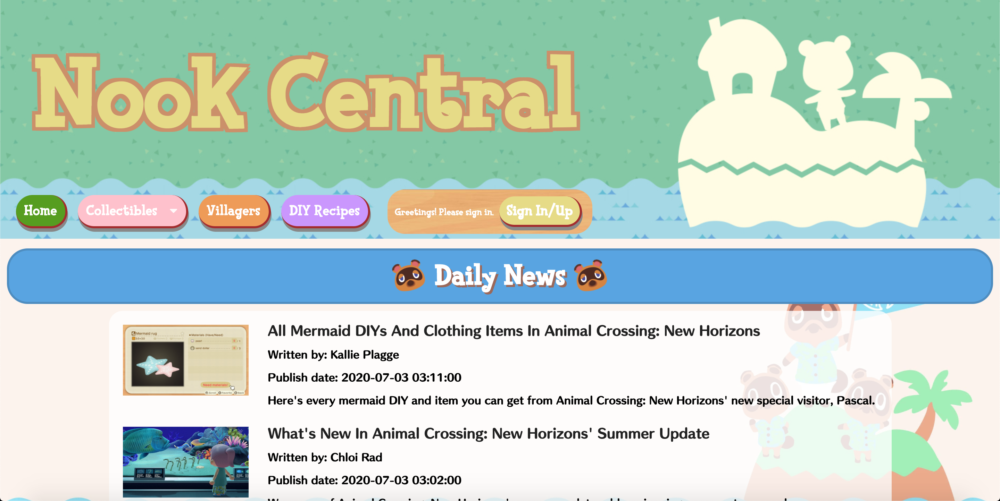
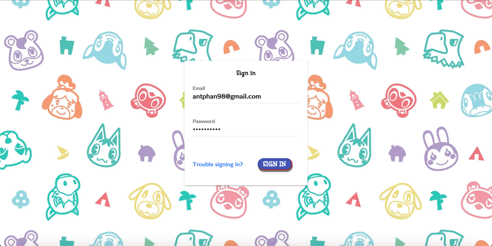
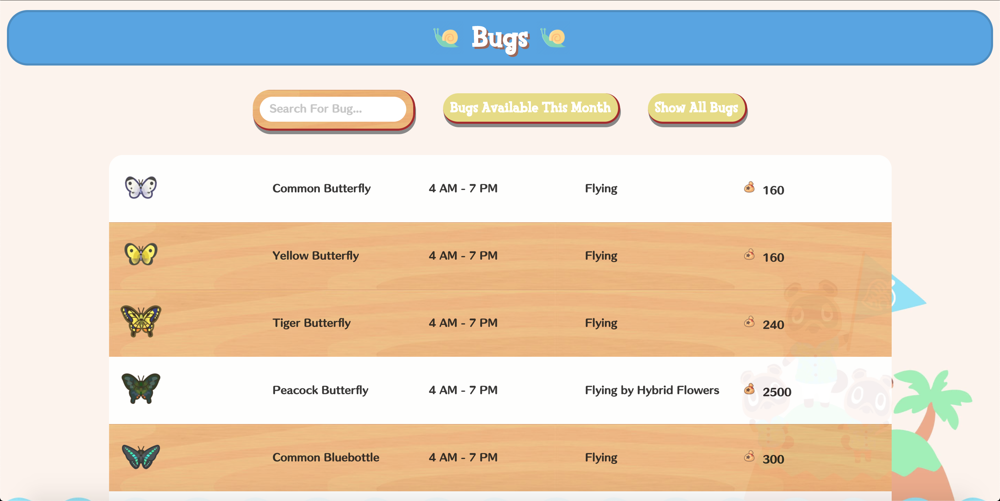
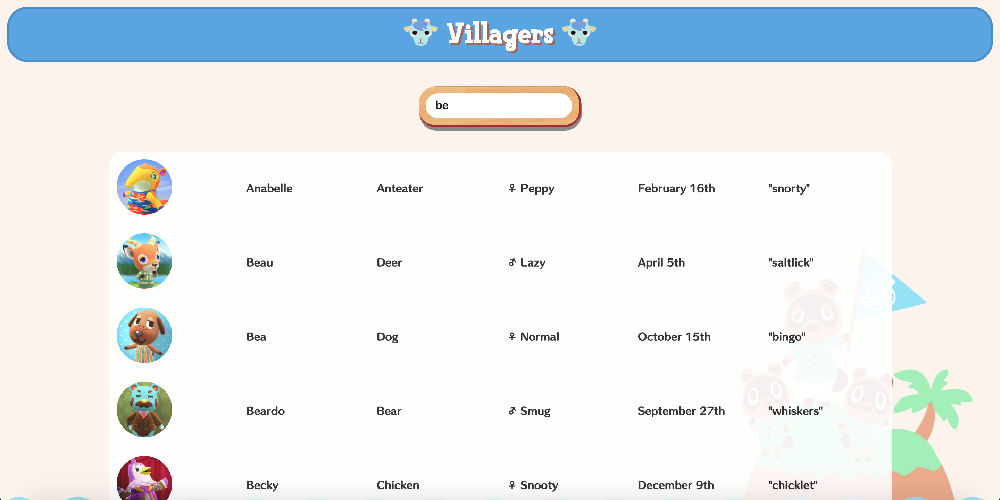

# Nook Central (An Animal Crossing: New Horizons Website)

 

## Introduction

**Deployed Link**: https://nook-central.herokuapp.com/

The idea of Nook Central is for users to be able to keep check of their progress in collecting a number of things. Forgot what you still need to catch before the month ends? This website will help you keep track! All you need to do is create an account and start collecting!

## Site Features

- ACNH news from GameSpot articles
- Villagers list

### Collections
- Art
- Bugs
- Deep Sea Creatures
- DIY Recipes
- Fish
- Fossils

## Technologies Used

- HTML, CSS, JavaScript
- Next.js
- React
- Firebase/Firestore
- Semantic UI React
- Node Fetch
- GameSpot API

## Future Development

- Display what user has collected only (with a button)
- Add turnip calculator page
- Add K.K. music page
